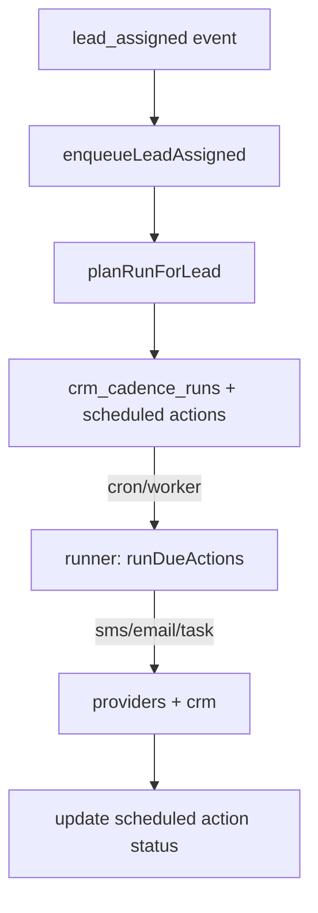

# Sales Cadence

- **Scope**: CRUD API, Planner, Runner, Events
- **Auth/RBAC**: Supabase-auth `requireAuth`; owner or admin required for write ops.

## Endpoints

- **GET** `/api/cadence`
  - Returns: `CadenceSummary[]`
- **GET** `/api/cadence/:id`
  - Returns: full `Cadence`
- **POST** `/api/cadence`
  - Body: `UpsertCadenceRequest`
  - Upserts the cadence and fully replaces `days` and `actions`.
- **POST** `/api/cadence/:id/activate`
  - Activates a cadence (owner/admin only)
- **POST** `/api/cadence/:id/deactivate`
  - Deactivates a cadence (owner/admin only)

Contracts live in `shared/contracts/cadence.ts`.

## Data Model (tables)

See `shared/schema.ts` (Sales Cadence section):

- `crm_cadences`
- `crm_cadence_days`
- `crm_cadence_actions`
- `crm_cadence_runs`
- `crm_cadence_scheduled_actions`
- `crm_cadence_events`

## Scheduling Rules

- `immediately`: same timestamp as prior action (or trigger time on day 1, else day start)
- `timeOfDay`: schedule at `HH:mm` of the day
- `afterPrevious`: minutes after previous action

## Flow



## Examples

- Upsert Cadence (POST `/api/cadence`)

```json
{
  "id": "cad-123",
  "name": "New Lead Cadence",
  "isActive": false,
  "timezone": "America/Los_Angeles",
  "trigger": { "type": "lead_assigned", "config": { "assignedTo": "<user-id-uuid>" } },
  "days": [
    {
      "dayNumber": 1,
      "actions": [
        {
          "id": "a1",
          "type": "sms",
          "scheduleRule": { "kind": "timeOfDay", "timeOfDay": "09:00" },
          "config": { "sms": { "body": "Hi {{firstName}}, welcome to Seed!" } }
        },
        {
          "id": "a2",
          "type": "email",
          "scheduleRule": { "kind": "afterPrevious", "minutesAfterPrev": 30 },
          "config": { "email": { "subject": "Getting started", "bodyHtml": "<p>Hello!</p>" } }
        }
      ]
    }
  ]
}
```

- Activate (POST `/api/cadence/:id/activate`)

```json
{ "success": true }
```

## Runner

- Entrypoint: `server/services/cadence/runner.ts` → `runDueActions({ limit })`
- Dispatches per action `type`:
  - `sms` → `sendSMS()`
  - `email` → `sendEmail()`
  - `call_task` → `createTask()`
- Status transitions: `scheduled` → `sent` | `skipped` | `failed`

## Migrations

- We use SQL files. Drizzle-kit config: `drizzle.config.ts` (`out: ./migrations`)
- Generate SQL (dev):
  - `doppler run --project seed-portal-api --config dev -- npx drizzle-kit generate`
- Apply SQL: apply the generated files with your standard SQL migration process (psql/Supabase CLI/CI).
